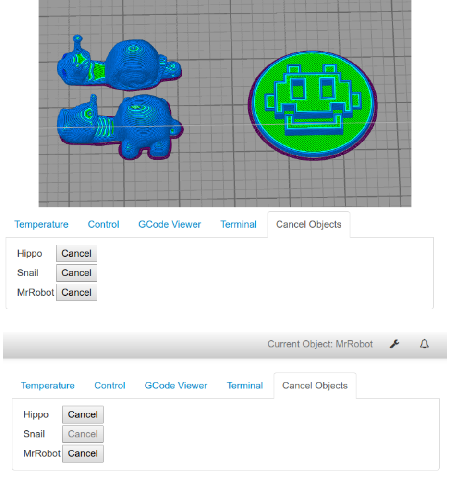

# OctoPrint-Cancelobject

This plugin allows the user to interactively cancel objects in gcode based on comment tags added by the slicer.
See below for instructions for specific slicers.

### New version 0.1.2
* Visual improvements in the plugin Tab.
* Convert allowed GCODE section to regular expression for greater slicer compatibility.
* Backend changes to allow for future feature-specific cancelling.

## Setup

Install via the bundled [Plugin Manager](https://github.com/foosel/OctoPrint/wiki/Plugin:-Plugin-Manager)
or manually using this URL:

    https://github.com/paukstelis/OctoPrint-Cancelobject/archive/master.zip

## Configuration
### Settings
* By default, active object (current object being queued) is displayed in the NavBar.
* Gcode (comma delimited) can be injected before or after the server reaches a cancelled object.
  This may be need for retractions or resetting extrusion distance in some cases.
* Gcode blocks that contain just functional information, like beginning or ending scripts, can be prevented from appearing in the tab by including them in a comma delimited list in the Ignored Object section. Defaults to `STARTGCODE,ENDGCODE`
* If there are Gcode commands in a cancelled object that should not be skipped, these can be included as a comma delimited list.
* For all slicers, it is recommended to enable relative extrusion in printer settings.
### Simplify3D
* Create one process for each object or group of models you want to be able to cancel. Assign models to processes.
* Enable 'Allow zeroing of extrusion distance' setting in Gcode Tab.
* It is recommended to add `; process ENDGCODE` at the start of your Ending Script in S3D. Otherwise, if the last object that would be printed has been cancelled this will result in the rest of the ending script being ignored.
### Slic3r - normal printing
* Use the current development build snapshot: https://dl.slic3r.org/dev/
* For Prusa Edition, see Windows build referenced here: https://github.com/prusa3d/Slic3r/issues/972
* Enable `Label prints with object ID` in the Output section
* Add `; printing object ENDGCODE` to the start of the end gcode in the Custom Gcode section.
* Modify the plugins object regex to: `; printing object (.*)`
### Slic3r - sequential printing
* For the start custom GCODE, include at the end: `; process 0`
* For the end custom GCODE, include at the start: `; process ENDGCODE`
* For the between object custom GCODE, include: `; process [current_object_idx]`
* Other changes may also be necessary to handle retractions and extrusion resets
### Cura
* Using Cura requires using a non-master branch of the CuraEngine. You'll have to compile this yourself. Find it here: https://github.com/Ultimaker/CuraEngine/tree/feature_comments_per_object
* As of now, it will only provide numbers for each object. 